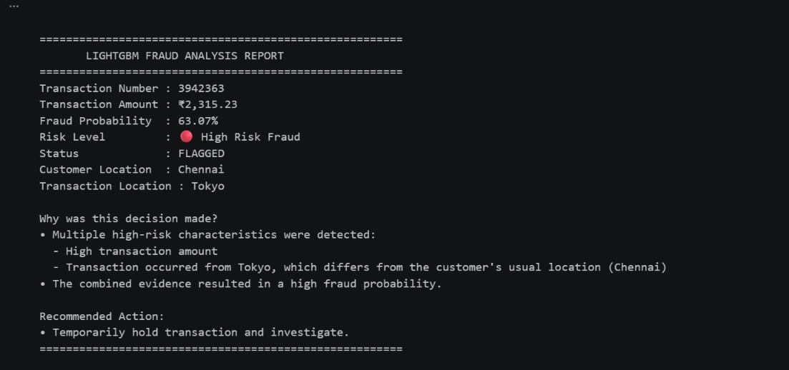

# Machine Learning-Based Financial Fraud Detection and Transaction Risk Analytics System

## 1. Abstract

Financial fraud has become a major challenge for banks and financial institutions due to the rapid growth of digital transactions and online payment systems. This project presents a Machine Learning-Based Financial Fraud Detection and Transaction Risk Analytics System capable of identifying potentially fraudulent transactions and generating explainable fraud risk assessments. A dataset containing five million financial transactions was analyzed using Exploratory Data Analysis (EDA), data preprocessing, and feature engineering techniques. Multiple machine learning algorithms, including Random Forest, LightGBM, and XGBoost, were implemented and compared. The developed system estimates fraud probabilities and classifies transactions into Low Risk, Suspicious, and High Risk Fraud categories. Furthermore, an explainable fraud analysis simulator was developed to provide reasons behind risk classifications and recommend appropriate actions. The proposed framework serves as an early warning system that can assist financial institutions in prioritizing transaction investigations and minimizing financial losses.

---

## 2. Introduction

The rapid growth of digital banking, online payment systems, and electronic transactions has significantly increased the risk of financial fraud across the world. Financial institutions process millions of transactions every day, making it difficult to manually monitor and identify fraudulent activities. Fraudulent transactions can result in substantial financial losses, damage organizational reputation, and reduce customer trust.

Traditional rule-based fraud detection systems often struggle to adapt to changing fraud patterns and large volumes of transaction data. As fraudsters continuously develop new methods to bypass security measures, there is a growing need for intelligent systems that can analyze transaction behaviour and identify suspicious activities efficiently.

Machine learning techniques provide an effective approach for fraud detection by identifying hidden patterns and anomalies within transaction data. These techniques can estimate fraud probabilities, classify transactions based on risk levels, and support decision-making processes for financial institutions.

This project aims to develop a Machine Learning-Based Financial Fraud Detection and Transaction Risk Analytics System capable of analyzing large-scale transaction data and generating explainable fraud risk assessments. The system utilizes multiple machine learning algorithms, including Random Forest, LightGBM, and XGBoost, to identify potentially fraudulent transactions and classify them into Low Risk, Suspicious, and High Risk Fraud categories. Additionally, an explainable fraud analysis simulator is developed to provide reasons behind risk classifications and recommend appropriate actions for further investigation.

---

## 3. Problem Statement

Financial institutions process millions of digital transactions every day, making the identification of fraudulent activities increasingly difficult. The presence of severe class imbalance, where fraudulent transactions represent only a small fraction of total transactions, further complicates fraud detection. Traditional rule-based systems often fail to adapt to evolving fraud patterns and may either miss fraudulent activities or generate excessive false alarms.

Therefore, there is a need for an intelligent fraud detection framework capable of analyzing large-scale transaction data, estimating fraud probabilities, identifying suspicious behaviour, and providing explainable risk assessments. Such a system can assist financial institutions in prioritizing investigations and reducing potential financial losses caused by fraudulent transactions.

---

## 4. Objectives
1. To analyze large-scale financial transaction data and understand fraud patterns.

2. To perform data preprocessing and feature engineering for machine learning applications.

3. To develop and compare multiple machine learning models, including Random Forest, LightGBM, and XGBoost, for fraud detection.

4. To estimate fraud probabilities and classify transactions into Low Risk, Suspicious, and High Risk Fraud categories.

5. To develop an explainable fraud analysis simulator that provides reasons behind risk classifications and recommends appropriate actions.

6. To design an early warning fraud detection framework that can assist financial institutions in transaction monitoring and risk assessment.
---

## 5. Dataset Description
- Dataset Size: 5,000,000
- Number of Features:18
- Target Variable:IS_FRAUD
- Fraud Transactions:1,79,553
- Non-Fraud Transactions:4,820,447
- Dataset Size : Approximately 653 MB

the dataset includes numerical and categorical variables

---

## 6. Dataset Features

| Feature | Description |
|---------|-------------|
| transaction_id | Unique identifier assigned to each transaction |
| timestamp | Date and time of the transaction |
| sender_account | Account initiating the transaction |
| receiver_account | Destination account receiving the transaction |
| amount | Monetary value of the transaction |
| transaction_type | Type of transaction (payment, transfer, withdrawal, etc.) |
| merchant_category | Category of merchant associated with the transaction |
| location | Location from which the transaction was performed |
| device_used | Device used to perform the transaction |
| is_fraud | Target variable indicating whether a transaction is fraudulent |
| fraud_type | Type of fraud associated with fraudulent transactions |
| time_since_last_transaction | Time elapsed since the previous transaction |
| spending_deviation_score | Measure of deviation from normal spending behaviour |
| velocity_score | Indicator of transaction frequency |
| geo_anomaly_score | Measure of geographical transaction abnormality |
| payment_channel | Medium through which payment was made |
| ip_address | IP address associated with the transaction |
| device_hash | Unique device identifier |
---

## 7. Methodology

### Step 1: Data Collection
The financial transaction datset containing five million records was collected and loaded for analysis.
### Step 2: Exploratory Data Analysis
Exploratory analysis was performed to understand data distrubution ,fraud patterns, missing values, and relationships among variables.
### Step 3: Data Cleaning
Missing values were handled , unnecessary columns were removed,and categorical variables were transformed into numerical representations.
### Step 4: Feature Engineering
Behavioural and transactional features contributing to fraud detection were identified and prepared for model training.
### Step 5: Model Development
Multiple machine learning algorithms including RandomForest,LightGBM,  and XGBoost were trained and evaluated .
### Step 6: Model Evaluation
The models were evaluated using metrics such as Accuracy,Precision,Recall,F1-Score, and Confusion matrix
### Step 7: Fraud Analysis System
An explainable fraud analysis simulator was developed to estimate  fraud probabilities, classify transactions into risk  levels, and generate reasons and recommendations  for decision-making

---

## 8. Data Preprocessing
The raw financial transaction dataset contained both numerical and categorical variables, along with several identifier columns and missing values. Therefore, data preprocessing was performed to prepare the dataset for machine learning model development.

The following preprocessing steps were carried out:

1. Dataset Inspection
The dataset structure, data types, missing values, and class distribution were examined to understand the characteristics of the data.

2. Removal of Identifier Columns
Columns that did not contribute to fraud prediction and could potentially introduce data leakage were removed. These columns included:
• transaction_id
• timestamp
• sender_account
• receiver_account
• ip_address
• device_hash
• fraud_type

3. Handling Missing Values
The 'time_since_last_transaction' feature contained missing values. Missing values were handled by replacing them with zero, indicating that no previous transaction information was available.

4. Creation of Missing Value Indicator
A binary indicator named 'time_missing_flag' was initially created to identify records with missing values in 'time_since_last_transaction'. However, this feature was later removed after identifying its potential to introduce information leakage.

5. Encoding of Categorical Variables
Machine learning algorithms require numerical input data. Therefore, One-Hot Encoding was applied to transform categorical variables into numerical representations.

The following categorical variables were encoded:
• transaction_type
• merchant_category
• location
• device_used
• payment_channel

6. Preparation of Model Features
After preprocessing and encoding, the dataset was converted into a numerical feature matrix suitable for machine learning algorithms such as Random Forest, LightGBM, and XGBoost.

The preprocessing stage ensured that the dataset was clean, numerically represented, and suitable for large-scale fraud detection modelling.
---

## 9. Feature Engineering
Feature engineering was performed to identify and utilize transaction characteristics that could effectively distinguish fraudulent transactions from legitimate ones. The dataset contained several behavioural and transactional indicators that were directly used as features for fraud detection.

The following features played a significant role in fraud prediction:

1. Transaction Amount (amount)
Represents the monetary value of a transaction. Transactions involving unusually high amounts may indicate potentially fraudulent activities.

2. Time Since Last Transaction (time_since_last_transaction)
Represents the time elapsed since the previous transaction. Extremely short intervals between transactions may indicate suspicious behaviour or automated fraudulent activity.

3. Spending Deviation Score (spending_deviation_score)
Measures how much a transaction deviates from the user's normal spending pattern. High deviation values may indicate abnormal spending behaviour.

4. Velocity Score (velocity_score)
Measures transaction frequency and activity levels. A high velocity score indicates rapid transaction activity within a short period and may suggest fraudulent behaviour.

5. Geographical Anomaly Score (geo_anomaly_score)
Measures how unusual the transaction location is compared to the user's normal transaction locations. Higher values indicate potentially suspicious geographical activity.

6. Transaction Type
Different transaction types such as transfers, withdrawals, and payments may exhibit varying fraud patterns.

7. Merchant Category
Transactions associated with specific merchant categories may carry different levels of fraud risk.

8. Transaction Location
Locations such as Dubai, London, New York, and other regions contributed to fraud prediction by helping identify unusual transaction patterns and geographical anomalies.

9. Device Used
Information regarding the device used for the transaction helped identify suspicious transaction behaviour occurring from uncommon devices.

10. Payment Channel
The payment medium, including card payments, wire transfers, and UPI transactions, contributed to fraud risk assessment by revealing transaction preferences and behavioural patterns.

Feature importance analysis performed using XGBoost and LightGBM indicated that behavioural features such as spending_deviation_score, velocity_score, geo_anomaly_score, and transaction amount were among the most influential factors contributing to fraud prediction. These features enabled the machine learning models to estimate fraud probabilities and generate explainable risk assessments.
---

## 10. Machine Learning Models

### 10.1 Random Forest
Random Forest is an ensemble machine learning algorithm that constructs multiple decision trees and combines their predictions to improve classification performance and reduce overfitting. The algorithm is widely used because of its robustness, ability to handle large datasets, and capability to estimate feature importance.

In this project, Random Forest was implemented as a baseline ensemble learning model for fraud detection. The model was trained using balanced class weights to address the severe class imbalance present in the dataset.

However, despite class balancing and threshold adjustments, Random Forest was unable to effectively detect fraudulent transactions. The model predominantly predicted transactions as non-fraudulent and failed to generate meaningful fraud probability estimates. Therefore, Random Forest was considered unsuitable for the highly imbalanced fraud detection problem addressed in this study.

### 10.2 LightGBM
Light Gradient Boosting Machine (LightGBM) is a gradient boosting framework developed by Microsoft that uses tree-based learning algorithms. It is designed for high performance, efficient memory utilization, and fast training on large-scale datasets.

LightGBM was implemented due to its capability to process millions of observations efficiently and its effectiveness in handling complex tabular data. The algorithm generated meaningful fraud probability estimates and demonstrated excellent fraud detection capability by identifying the majority of fraudulent transactions.

Feature importance analysis indicated that behavioural features such as spending deviation score, time since last transaction, transaction amount, geographical anomaly score, and transaction velocity were major contributors to fraud prediction. LightGBM successfully functioned as an early warning fraud detection system capable of identifying suspicious transactions for further investigation.

### 10.3 XGBoost
Extreme Gradient Boosting (XGBoost) is an advanced gradient boosting algorithm designed for high predictive performance, scalability, and effective handling of structured datasets. The algorithm utilizes gradient boosting techniques to iteratively improve prediction performance and reduce classification errors.

In this project, XGBoost demonstrated superior capability in fraud detection and risk assessment. The model generated meaningful fraud probability scores and successfully classified transactions into Low Risk, Suspicious, and High Risk Fraud categories.

Feature importance analysis revealed that transaction amount, spending deviation score, transaction velocity, geographical anomaly score, transaction location, payment channel, and transaction type significantly contributed to fraud prediction. The probability estimation capability of XGBoost enabled the development of an explainable fraud analysis simulator that provided reasons behind risk classifications and recommended actions for transaction investigation.

Due to its strong fraud detection performance, explainability, and ability to generate meaningful risk probabilities, XGBoost was selected as the final model for deployment in the proposed fraud detection system.

---

## 11. Fraud Analysis System
### Table: Comparison of Machine Learning Models

### Table: Comparison of Machine Learning Models

## Final Model Ranking

🥇 XGBoost
- Excellent fraud probability estimation
- High recall (~98%)
- Strong explainability
- Best suited for deployment

🥈 LightGBM
- Very fast training
- Excellent fraud detection capability
- Behaviour-driven feature importance
- Strong alternative to XGBoost

🥉 Random Forest
- High accuracy due to class imbalance
- Failed to detect fraudulent transactions effectively
- Unsuitable for deployment on highly imbalanced fraud datasets

Random Forest   █░░░░░ 20%
LightGBM        ████░░ 85%
XGBoost         █████░ 95%
---

## 12. Results and Discussion
## 12.1 Dataset Analysis Results
Exploratory Data Analysis revealed that the dataset was highly imbalanced. Fraudulent transactions represented only a small fraction of the total transactions, while the majority of transactions were legitimate.

The dataset contained 5,000,000 transactions, out of which 179,553 transactions were labelled as fraudulent and 4,820,447 transactions were labelled as non-fraudulent. This severe class imbalance significantly influenced model training and evaluation.

## 12.2 Feature Importance Results
Feature importance analysis performed using XGBoost and LightGBM indicated that behavioural features contributed significantly to fraud prediction.

The most influential features included:

• Transaction Amount
• Spending Deviation Score
• Velocity Score
• Geographical Anomaly Score
• Time Since Last Transaction
• Transaction Location
• Payment Channel
• Merchant Category
• Device Used

These features enabled the machine learning models to identify abnormal transaction behaviour and estimate fraud probabilities effectively.

## 12.3 Model Comparison Results

| Metric | Random Forest | LightGBM | XGBoost |
|:-------|:-------------:|:--------:|:--------:|
| Recall | ❌ 0% | ✅ 98% | ✅ 98% |
| Fraud Probability Generation | ❌ Poor | ✅ Good | ✅ Excellent |
| High-Risk Fraud Detection | ❌ No | ✅ Yes | ✅ Yes |
| Explainability | 🟡 Moderate | ✅ High | ✅ High |
| Final Deployment Decision | ❌ Rejected | 🟡 Alternative | 🟢 Selected |

## Final Model Ranking

🥇 XGBoost
████████████████████ 95%

🥈 LightGBM
██████████████████░░ 90%

🥉 Random Forest
████░░░░░░░░░░░░░░░░ 20%

---

## 13. Conclusion
(Write conclusion)

---

## 14. Future Scope
1. SHAP Explainability
2. Threshold Optimization
3. Real-Time Dashboard
4. Deep Learning Approaches